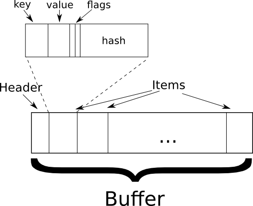
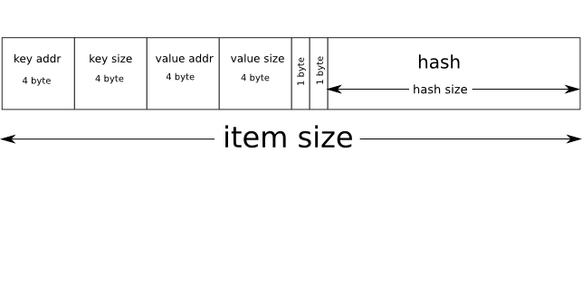

# C Mapreduce library for ZeroVM

## Introduction

Mapreduce library is small library written in C to provide interface for
ZeroVM mapreduce framework. Framework consists of several zerovm sessions
(both map and reduce nodes), connected to each other via network channels.

It requires user to define map, reduce, compare functions to perform a mapreduce
job. 

Variable-length keys and values are used in mapreduce framework. Fixed-length
keys and values could be used, though. It's user's responsibility to decide what
type keys and values to be used.

## Fundamental data types

Mapreduce framework operates on raw data buffer deeply inside. This "buffer" 
can be thought as vector of mapreduce items (_ElasticBufItemData_ type). _Buffer_
consists of header with buf_size, item_size, item_count fields and raw data pointer.
Each item is simply a chunk of raw data.

	typedef struct BufferHeader {
		// size of buffer in bytes
		size_t buf_size;
		// size of mapreduce item in bytes
		size_t item_size;
		// items count in buffer, could be less than buf_size/item_size
		size_t count;
	} BufferHeader;
	typedef struct Buffer {
		// buffer header data
		BufferHeader header;
		// buffer raw data
		char *data;
	} Buffer;

Items has fixed size. Items count should be less than `buf_size/item_size`. Buffer
has to be reallocated if item appending is necessary.

User has to define mapreduce item size at initialization.

Mapreduce item used for variable-length keys and values defined as following:

	// Mapreduce item size must be defined manually due to variable hash size
	typedef struct ElasticBufItemData {
			// key (pointer to data and its size)
			BinaryData     key_data;
			// value (pointer to data and its size OR data itself in value.addr field)
			BinaryData     value; 
			// key.addr and value.addr pointer is "owned" by user function (map, reduce)
			// and has to be freed manually
			uint8_t        own_key; 
			uint8_t        own_value; 
			// mapreduce item hash, should be treated as uint8_t* ptr = &key_hash;
			uint8_t        key_hash; 
	} ElasticBufItemData;
	// binary data
	typedef struct BinaryData{
			// pointer to actual data OR data itself
			uintptr_t addr;
			// size of data OR 0
			int       size;
	} BinaryData;

Due to key/value variable length all data is allocated on the heap. It could be
allocated by framework (and passed to Map function, see later) or by user itself.
Flags `own_key/own_value` are used to indicate whenever user has to free data manually
in user defined functions.
If data is small enough to fit addr field (4/8 bytes) one can use it without 
allocating data on the heap. In this case one ought to set key/value size to 0 to
indicate "Value Addr is Data" mode is enabled. 
Hash field has fixed length, defined at initialization. 

## Framework overview

Mapreduce framework consists of nameserver, map nodes and reduce nodes. 
These nodes essentially are ZeroVM instances, controlled by mapreduce framework.
Nameserver is used as "manager". (need to specify what is it, what it does)

Nodes are connected via network channels (see ZeroVM doc). Each map node has separate
read and write channels to other map nodes. It also has write channels to each
reduce node. Reduce nodes have only read channels to each map node.

## Data flow

Each map node has some input (regular file, typically). Mapreduce library reads
input chunk by chunk (chunk size is defined in ENV variable MAP\_CHUNK\_SIZE), passing
each chunk (as pointer to data) to user-defined Map function . This function parses
data and fills output buffer with appropriate mapreduce items.

After user-defined map step, items are sorted by hash. Next, these items could 
be combined (if user-defined Combine is present) before network transfer.

Data is transfered over the network to reduce nodes. Reduce nodes receive input data,
combining it if possible (due to several map nodes are present). 
Then user-defined reduce function is called with input buffer (vector of mapreduce items). 
These items are the same as output of map function if combine is not present. 
They are "combined", otherwise. Reduce node should perform last "reduce" step and print output.

## Usage

See documented source code sample below:

	// some function that performs map/reduce node init
	void InitInterface(struct MapReduceUserIf* mr_if ) {
			// zero-fill MapReduceUserIf struct
			memset( mr_if, '\0', sizeof(struct MapReduceUserIf) );
			// filling fields with user defined functions, item and hash size
			PREPARE_MAPREDUCE(mr_if, 
						// pointer to user-defined Map function
						Map, 
						// pointer to user-defined Combine function
						NULL, 
						// pointer to user-defined reduce function
						Reduce, 
						// pointer to user-defined comparator sorting function
						ComparatorElasticBufItemByHashQSort, 
						// pointer to user-defined comparator function
						ComparatorHash,
						// pointer to user-defined printing hash function
						PrintableHash,
						// "Value Addr Is Data" mode is on (1)/off (0)
						0,
						// mapreduce item size
						ALIGNED_RECORD_SIZE,
						// hash size
						HASH_SIZE );
	}

## User defined function description

### Map

	int Map(const char *data, size_t size, int last_chunk,  Buffer *map_buffer);

Map function must parse input `data` with given `size` and fill in `map_buffer` with 
mapreduce items. `last_chunk` flag indicates that last portion of data.

User could create mapreduce items pointing to existing data (somewhere in `data`)
and set `own_key`, `own_value` to 0. One could also malloc some data on the heap,
fill it with arbitrary data and set `own_whatever` to 1. 
It's user responsibility to alloc `map_buffer` raw data to make it store necessary
item count.

Function must return byte count processed.

### Reduce

	int Reduce(const Buffer *reduced_buffer);

Reduce funtion gets `reduced_buffer` (vector of mapreduce items) as input. It performs
"reduce" step for given data. Reduce function must free data, pointed by mapreduce
items with `own_key`,`own_value` flags set.

### Combine

	int Combine(const Buffer *map_buffer, Buffer *reduce_buffer);

This function is not required. It performs "in-place" reduce at map node in order
to compress data before network transfer. It also combines input data for reduce 
nodes before actual reduce step.`map_buffer` is input data, `reduce_buffer`
is output data. 
User must free data, pointed by mapreduce items with `own_key`,`own_value` flags 
set in `map_buffer`.

### ComparatorElasticBufItemByHashQSort

	ComparatorElasticBufItemByHashQSort(const void *p1, const void *p2);

Function used by mapreduce library to sort items with qsort. This step is performed
at map nodes after user-defined Map function is called. 

p1 and p2 are pointers to hash. Hash size is fixed and is known to user _apriori_
(user sets hash size himself at init).

Function must return +1 if p1 > p2, -1 if p1 < p2, 0 if p1 == p2

### ComparatorHash

	ComparatorHash(const void *h1, const void *h2);

Function is used to compare hashes for two mapreduce items. Actually, this 
comparator is never used by framework itself.

h1 and h2 are pointers to hash as in ComparatorElasticBufItemByHashQSort.

Function must return +1 if h1 > h2, -1 if h1 < h2, 0 if h1 == h2

## Detailed mapreduce item/hash size, "Value Addr Is Data" description

Mapreduce item consists of 8 byte `key` field (4 byte addr and 4 byte size),
8 byte `value` field(4 byte addr and 4 byte size), 1 byte `own_key` flag, 1 byte
`own_value` flag and hash with user-defined size.

So, mapreduce size must not be less than 18 + hash size bytes. For example, given 
hash size 10 bytes mapreduce item size would be 28 bytes.

One could use key and value fields as pointers to some memory with arbitrary size.
In this case `addr` field points to memory address, `size` holds memory area size.
This is "normal" mode. On the other hand, value (__and only value!__) could hold
some data in addr field (e.g. some integer or float or whatever). This is called
"Value Addr Is Data" mode. 'size' field __must__ be set to 0. Anyway, user has to
handle with it in map, combine and reduce functions. Mapreduce framework simply
transmits raw data.

## Helper functions from mapreduce library

This section has not been written yet.

## Examples

See terasort and wordcount directories in zerovm-samples [repository](https://github.com/zerovm/zerovm-ports).